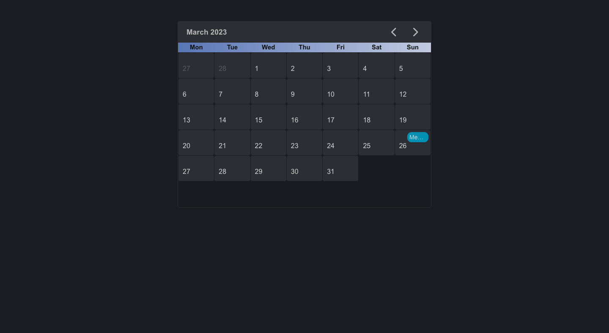
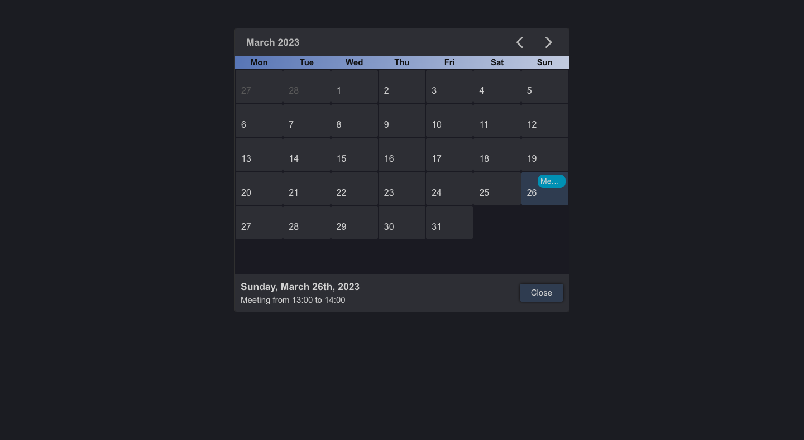

# Vue Calendar

## Get Started

If you want to see the project without deploying it locally, you can follow this link to GitHub Pages: 
https://georgedeyneka.github.io/VueCalendar/

So, if you want to look at the project's code and deploy it, follow the steps below in the "Installation" section.

### Installation

1. Clone the repo
```sh
git clone https://github.com/GeorgeDeyneka/VueCalendar.git
```
2. Install NPM packages
```sh
npm install
```
3. Run this command for a dev server. Navigate to `http://localhost:5174/`. The application will automatically reload if you change any of the source files.
```sh
npm run dev
```

## About project

This is my test case within Vue.js. I am using Vue3 framework and date-fns library.

### Built With

- 
- 
- 
- 
- 
- 
- 

### Recommended IDE Setup

[VSCode](https://code.visualstudio.com/) + [Volar](https://marketplace.visualstudio.com/items?itemName=Vue.volar) (and disable Vetur) + [TypeScript Vue Plugin (Volar)](https://marketplace.visualstudio.com/items?itemName=Vue.vscode-typescript-vue-plugin).


## Usage

### Main Page
<div>
  <ul>
    <li>
    Expanding the application, you will see a calendar grid in front of you, lined up from Monday to Sunday.
    </li>
    </br>
    <li>
    You can switch months using the arrows at the top. Note that the last month's numbers have different styles, which simplifies the visual interface.
    </li>
  </ul>
  </br>

</div>

</br>

---

### Events in calendar
<div>
  <ul>
    <li>
    So, if you switch to March 2023, look out for the 26th. There is a mark here that indicates that an event is scheduled for that day.
    </li>
    </br>
    <li>
    Just click on that day and you will see the full details of the scheduled event.
    </li>
    </br>
    <li>
    For convenience, the day you are viewing information will be marked with a special color in the calendar.
    </li>
    </br>
    <li>
    So, you have viewed an event, but you want to hide information about this day and events. Just click on the "Close" button and the block will be hidden.
    </li>
  </ul>
  </br>

</div>

</br>

## Contributing

Contributions are what make the open source community such an amazing place to learn, inspire, and create. Any contributions you make are **greatly appreciated**.

If you have a suggestion that would make this better, please fork the repo and create a pull request. You can also simply open an issue with the tag "enhancement".

If you want to improve the project code, you need to:

1. Fork the Project
2. Create your Feature Branch (`git checkout -b feature/AmazingFeature`)
3. Commit your Changes (`git commit -m 'Add some AmazingFeature'`)
4. Push to the Branch (`git push origin feature/AmazingFeature`)
5. Open a Pull Request

Don't forget to give the project a star! Thanks again!


## My Contacts (Links)

- <a href="https://www.linkedin.com/in/george-deyneka-910003238/">
    
  </a> 
- <a href="https://t.me/Deyneka_George">
    
  </a> 
- <a href="mailto: zhoradeynecka@gmail.com">
    
  </a> 
